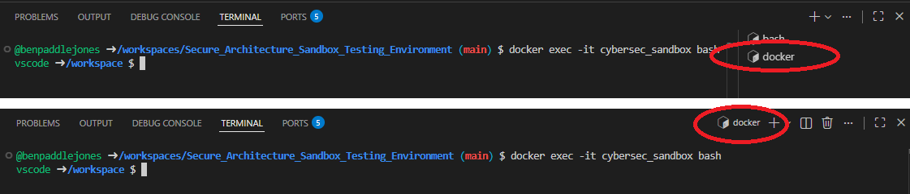

# Sandbox Security Analysis Exercise

## 🎯 Overview

Sandbox security analysis involves testing applications in isolated, controlled environments to detect malicious behaviour and security vulnerabilities. This technique provides **safe execution environments for untrusted code** while monitoring system behaviour for threats.

**Syllabus Alignment:**
- **Sandboxing contribution to security by design**: Application isolation and containment  
- **Safe execution environments**: Resource limitation and monitoring
- **Behavioural analysis and threat detection**: Identifying malicious application behaviour
- **Security testing and evaluation**: Systematic vulnerability assessment through behavioural monitoring

**Real-World Application:** Professional cybersecurity teams use sandbox analysis to safely examine malware, test suspicious applications, and analyse security threats without risking production systems.

## � Prerequisites

**Required Knowledge:**
- Basic understanding of operating systems and processes
- Command line navigation skills
- Basic Python syntax
- Understanding of files, networks, and system resources

**Technical Setup:**
```bash
# Navigate to main project folder
cd /workspaces/Secure_Architecture_Sandbox_Testing_Environment

# Start Docker services
docker-compose -f docker/docker-compose.yml up -d

# Enter the sandbox container
docker exec -it cybersec_sandbox bash
```

### Check your terminal is now executing to the docker



**What is Sandbox Analysis?**
Think of sandbox analysis like having a separate, monitored workshop where you can safely test suspicious tools:
- **Isolated Environment**: Like a workshop separated from your main house
- **Complete Monitoring**: Like having cameras watching everything that happens  
- **Safe Observation**: Like watching from behind protective glass
- **No Real Damage**: If something goes wrong, it only affects the workshop

**Security Testing Method Comparison:**

| Method | SAST (Static) | DAST (Dynamic) | Sandbox Analysis |
|--------|---------------|----------------|------------------|
| **Analysis Type** | Source code review | Running app testing | Behavioural monitoring |
| **When to Run** | During development | During runtime | During execution |
| **Environment** | No execution needed | Production-like | Isolated/controlled |
| **Finds** | Code vulnerabilities | Runtime vulnerabilities | Malicious behaviour |

## 🔧 Step-by-Step Activities

### Activity 1: Understanding Sandbox Architecture

**Syllabus Focus:** **Application isolation and containment** principles

**Step 1.1: Explore the Sandbox Environment**
```bash
# Connect to the security tools container
docker exec -it cybersec_sandbox bash # Should change terminal to `docker`
hostname -I  # Should show: 172.20.0.4
```

**Step 1.2: Understand the Network Isolation**
```bash
# Scan for other containers in the sandbox network
nmap -sn 172.20.0.1-100

# Check network connectivity
ping -c 3 172.20.0.3  # Should work (internal network)
ping -c 3 google.com   # Should fail (no external access)
```

**Why This Matters:** This demonstrates **resource limitation and monitoring** - the sandbox prevents applications from accessing external resources while allowing controlled testing.

### Activity 2: Basic Behavioural Analysis

**Syllabus Focus:** **Behavioural analysis and threat detection**

**Important:** All suspicious applications must be analysed inside the sandbox container to ensure proper isolation and monitoring.

**Step 2.1: Examine a Suspicious Script (Safely)**
```bash
# Ensure you're inside the sandbox container
docker exec -it cybersec_sandbox bash

# Navigate to sample applications
cd /workspace/samples/suspicious-scripts

# View the script WITHOUT executing it
cat suspicious_script.py
```

**Look for these patterns:**
- Network connections (`socket`, `urllib`)
- File operations (`open`, `write`, `os.remove`)
- System commands (`subprocess`, `os.system`)
- Unusual imports or obfuscated code

**Step 2.2: Set Up Monitoring**
```bash
# Create analysis workspace (inside the container)
mkdir /tmp/analysis
cd /tmp/analysis

# Monitor system calls (tracks everything the application does)
strace -o syscalls.log -f python /workspace/samples/suspicious-scripts/suspicious_script.py &
SCRIPT_PID=$!
```

**Step 2.3: Monitor Network Activity**
```bash
# Capture network state before and after
netstat -tupln > network_before.log
sleep 10  # Let script run
netstat -tupln > network_after.log
kill $SCRIPT_PID 2>/dev/null
```

**Step 2.4: Analyse Results**
```bash
# Check for file operations
grep -E "(openat|write|read)" syscalls.log | head -5

# Check for network operations  
grep -E "(socket|connect|bind)" syscalls.log | head -5

# Compare network states
diff network_before.log network_after.log
```

### Activity 3: Web Application Backdoor Detection

**Syllabus Focus:** **Security testing and evaluation** through behavioural monitoring

**Important:** This activity must be performed inside the sandbox container to demonstrate proper isolation. The backdoor application runs internally without external access, simulating how malware operates in isolated environments.

**Step 3.1: Start Monitoring a Web Application**
```bash
# Ensure you're inside the sandbox container
docker exec -it cybersec_sandbox bash

# Navigate to the workspace inside the container
cd /workspace

# Start the backdoor application (runs internally on port 6000)
python samples/backdoor-apps/backdoor_app.py &
APP_PID=$!
sleep 5  # Let it start
```

**Step 3.2: Test Normal Functionality**
```bash
# Test normal web pages (from inside the container)
curl http://localhost:6000/
curl http://localhost:6000/about
```

**Step 3.3: Search for Hidden Functionality**
```bash
# Test common backdoor paths (from inside the container)
curl http://localhost:6000/admin
curl http://localhost:6000/shell  
curl http://localhost:6000/cmd
curl http://localhost:6000/backdoor

# Test actual hidden backdoor endpoints in this application
curl http://localhost:6000/admin_debug_console
curl http://localhost:6000/system_health_check
curl http://localhost:6000/backup_utility

# If backdoor found, test carefully (example with actual endpoint)
curl "http://localhost:6000/admin_debug_console?cmd=whoami"
curl "http://localhost:6000/backup_utility?action=read&file=/etc/passwd"
```

**Step 3.4: Analyse Findings**
```bash
# Check what files the application accessed
lsof -p $APP_PID | grep REG

# Stop the application
kill $APP_PID
```

### Activity 4: Resource Abuse Detection

**Syllabus Focus:** **Resource limitation and monitoring**

**Important:** Resource monitoring must be performed inside the sandbox to demonstrate proper resource isolation and control.

**Step 4.1: Baseline System Resources**
```bash
# Record normal resource usage
top -b -n 1 > baseline_resources.log
free -h > baseline_memory.log
```

**Step 4.2: Execute Resource-Intensive Application**
```bash
# Start crypto mining simulation (ensure you're in the container)
python samples/resource-abuse/crypto_miner.py &
MINER_PID=$!
```

**Step 4.3: Monitor Resource Consumption**
```bash
# Monitor CPU usage for 60 seconds
for i in {1..6}; do
    echo "=== Check $i ===" >> resource_monitor.log
    top -b -n 1 -p $MINER_PID >> resource_monitor.log
    sleep 10
done

# Stop the miner
kill $MINER_PID
```

**Step 4.4: Analyse Resource Impact**
```bash
# Compare CPU usage
echo "Normal CPU usage:"
head -15 baseline_resources.log | grep "Cpu(s)"

echo "During mining:"
grep "Cpu(s)" resource_monitor.log | tail -1
```

### Activity 5: Comprehensive Threat Assessment

**Step 5.1: Document Your Findings**
Create a security report for each analysis:

```bash
cat > security_report.txt << EOF
=== SANDBOX SECURITY ANALYSIS REPORT ===

Application Analysed: [Script/App name]
Risk Level: [Critical/High/Medium/Low]

Malicious Behaviour Detected:
- File system activity: [Description]
- Network activity: [Description]  
- Resource consumption: [Description]
- System commands executed: [Description]

Evidence:
- System calls of concern: [List key findings]
- Suspicious network connections: [List any found]
- Files created/modified: [List any found]

Conclusion: [Malicious/Suspicious/Benign and why]

Recommended Actions:
1. [Immediate response needed]
2. [Security controls to implement]
3. [Monitoring to establish]
EOF
```

## 📊 Summary

### Key Security Threats to Identify

Through sandbox analysis, you should discover these types of malicious behaviours:

**1. Unauthorized File Access**
- **Evidence**: System calls like `openat()`, `write()` to sensitive locations
- **Impact**: Data theft, configuration tampering, persistence mechanisms
- **Syllabus Connection**: File system security and access control

**2. Suspicious Network Activity**
- **Evidence**: Unexpected `socket()`, `connect()` calls to external IPs
- **Impact**: Data exfiltration, command and control communication
- **Syllabus Connection**: Network security and secure communication protocols

**3. Resource Abuse Patterns**
- **Evidence**: High CPU usage, excessive memory consumption
- **Impact**: System performance degradation, cryptocurrency mining
- **Syllabus Connection**: Resource limitation and monitoring

**4. Hidden Backdoor Functionality**
- **Evidence**: Command execution endpoints, unauthorized system access
- **Impact**: Remote control, privilege escalation, persistent access
- **Syllabus Connection**: Authentication bypass and authorization flaws

### Skills Developed

By completing this exercise, you have practiced:
- **Behavioural analysis**: Monitoring application activities in real-time
- **Container security**: Understanding isolation and containment principles
- **Threat detection**: Identifying malicious patterns through system observation
- **Security architecture**: Experience with professional-grade security testing environments

### Real-World Application

Sandbox analysis is essential in professional cybersecurity because:
- Detects unknown threats through behavioural patterns (zero-day protection)
- Provides safe environments for analysing malicious software
- Enables incident response teams to understand attack methods
- Supports threat intelligence gathering and security research

Sandbox analysis complements **Static Application Security Testing (SAST)** and **Dynamic Application Security Testing (DAST)** by providing behavioural monitoring that reveals threats during actual execution.

---

**Next Steps:** Apply behavioural analysis skills alongside code review, SAST, and DAST to build comprehensive security testing capabilities.
