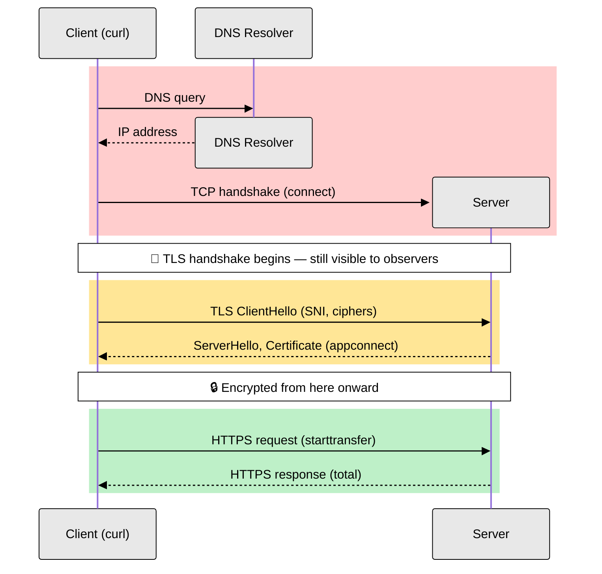

# Network Traffic Analysis Exercise

## 📖 Overview

Network Traffic Analysis is a cybersecurity technique that monitors, captures, and analyses network communications to detect security threats, unauthorised access, and malicious activities. It focuses on communication patterns and data flows between systems.

**Think of it this way:** If your computer network is like a building, network traffic analysis is like being a security guard who watches all the doors and windows to see who comes in, who goes out, and what they're carrying.

**This exercise aligns with these syllabus points:**
- **6.1.2 Analyse security requirements** - Monitor network communications for security compliance
- **6.1.3 Analyse network security components** - Examine network protocols and traffic patterns  
- **6.2.1 Implement secure network architecture** - Understanding network traffic helps design secure systems
- **6.2.2 Implement secure protocols** - Analyse how protocols behave and identify weaknesses

## 🎯 Prerequisites

### Technical Requirements
- Basic understanding of computer networks and TCP/IP
- Familiarity with command line interface
- Understanding of ports and network protocols

### Environment Setup
**Navigate to main folder:**
```bash
cd /workspaces/Secure_Architecture_Sandbox_Testing_Environment
```

**Test the network analysis tool:**
```bash
python src/analyser/network_cli.py --help
```

**Verify system network tools:**
```bash
which netstat && echo "✅ netstat available" || echo "❌ netstat missing"
```

## 📋 Activities

### Activity 1: Monitor Network Connections

**Objective:** Monitor active network connections to identify potentially suspicious communication patterns.

**Step 1: Check Current Connections**
```bash
cd /workspaces/Secure_Architecture_Sandbox_Testing_Environment
python src/analyser/network_cli.py --monitor-connections --educational
```

**Expected Output:**
```
🌐 NETWORK CONNECTION MONITORING
ACTIVE CONNECTIONS:
  localhost:5000 (PWA App) - Status: LISTENING
  localhost:9090 (Flask App) - Status: LISTENING
  localhost:22 (SSH) - Status: LISTENING
```

**Also try manual approach:**
```bash
netstat -tuln | head -20
```

**What to Look For:**
- **LISTEN**: Service waiting for connections (normal)
- **Port 22**: SSH (secure remote access)
- **Port 5000**: Our PWA application (primary target)
- **Port 9090**: Our Flask application

**Step 2: Identify Suspicious Activity**
```bash
# Check for connections to unusual ports
netstat -tuln | grep -E ":4444|:6666|:1337|:31337"
```

**Expected:** No output (these are malicious ports that shouldn't be in use)

**If you see output:** Could indicate backdoor/malware activity

**Step 3: Analyse Connection Patterns**
```bash
# Look for excessive connections from single IPs
netstat -tuln | awk '{print $5}' | cut -d: -f1 | sort | uniq -c | sort -nr
```

### Activity 2: Discover Network Services

**Objective:** Discover network services and assess their security implications.

**Step 1: Scan Local Services**
```bash
python src/analyser/network_cli.py --scan-services localhost --educational --verbose
```

**Step 2: Check for High-Risk Services**
```bash
# Look for potentially risky services
netstat -tuln | grep -E ":21|:23|:3389|:5900"
```

**What These Ports Mean:**
- **Port 21**: FTP (file transfer, often insecure)
- **Port 23**: Telnet (unencrypted remote access)
- **Port 3389**: Remote Desktop (potential attack vector)
- **Port 5900**: VNC (remote desktop, often unencrypted)

**Step 3: Examine Service Security**
```bash
# Generate detailed service report
python src/analyser/network_cli.py --scan-services localhost --format json --output service_scan.json
```

### Activity 3: Analyse Traffic Patterns

**Objective:** Analyse network traffic patterns to identify potential security threats.

**Step 1: Start Traffic Monitoring**
```bash
python src/analyser/network_cli.py --capture-traffic --duration 30 --educational
```

**Step 2: Generate Network Activity**
```bash
# In another terminal, generate network activity against the sandbox's own sample apps
curl http://localhost:5000/
curl -X POST http://localhost:9090/login -d "username=test&password=test"
ping -c 5 8.8.8.8
```

**Step 3: Analyse Results**
```bash
python src/analyser/network_cli.py --capture-traffic --duration 60 --format json --output traffic_analysis.json --educational
```

**Look For:**
- HTTP requests to legitimate servers
- DNS resolution activity
- Failed connection attempts
- Protocol usage patterns

### Activity 4: Monitor DNS Traffic

**Objective:** Monitor DNS queries to detect malicious domain communication.

**Step 1: Start DNS Monitoring**
```bash
python src/analyser/network_cli.py --dns-analysis --duration 30 --educational
```

**Step 2: Generate DNS Queries**
```bash
# Generate legitimate DNS queries
nslookup google.com
nslookup github.com
dig @8.8.8.8 stackoverflow.com
```

**Step 3: Analyse DNS Patterns**
```bash
python src/analyser/network_cli.py --dns-analysis --duration 60 --format json --educational --output dns_analysis.json
```

**Watch For:**
- Normal DNS resolution patterns
- Suspicious domain queries
- DNS query frequency patterns
- Potential DNS tunnelling indicators

### Activity 5: Investigate Security Scenario

**Scenario:** Multiple internal systems are making connections to an external IP on port 4444, with increased DNS queries to suspicious domains.

**Your Investigation Steps:**
1. Use network monitoring tools to investigate
2. Check for connections to port 4444
3. Monitor DNS queries for suspicious patterns
4. Document findings with evidence

**Investigation Commands:**
```bash
# Check for port 4444 connections
netstat -tuln | grep 4444

# Monitor for suspicious DNS activity
python src/analyser/network_cli.py --dns-analysis --duration 120 --educational

# Generate comprehensive network report (one mode per run)
python src/analyser/network_cli.py --monitor-connections --format json --educational --output reports/network_connections.json
python src/analyser/network_cli.py --capture-traffic --duration 60 --format json --educational --output reports/network_traffic.json
python src/analyser/network_cli.py --dns-analysis --duration 60 --format json --educational --output reports/network_dns.json
```

### Activity 6: Visualizing the Full HTTP Stream (DNS → TLS → HTTP)

**Objective:** Break down a single HTTPS request into its component phases
(DNS resolution, TCP connect, TLS handshake, HTTP transfer) and visualise the
raw request/response stream, to understand what happens "under the hood"
before any data is exchanged.



- 🔓 **Red** — DNS + TCP handshake: fully plaintext.
- 🟡 **Amber** — TLS handshake: sets up encryption, but the handshake itself
  is sent in the clear (hostname/SNI, cipher suites, and the server
  certificate are all visible to an observer). Ends at `appconnect`.
- 🔒 **Green** — HTTP request/response: the only part that's actually
  encrypted, sent after the handshake completes.

**Step 1: See the actual DNS query and response**

```bash
dig example.com
```

This is the literal DNS lookup happening in the 🔓 red zone of the diagram
above. Look for:
- **QUESTION SECTION** — what you asked for (`example.com`, type `A`)
- **ANSWER SECTION** — the IP address(es) returned
- **Query time** — how long the DNS server took to respond
- **SERVER** — which DNS resolver answered (usually a local one, e.g.
  `127.0.0.53`, which then asks upstream servers on your behalf)

`nslookup example.com` shows the same information in a shorter, less
detailed format if you prefer.

**Step 2: Time each phase of the connection**

```bash
curl -w '\nnamelookup:%{time_namelookup}\nconnect:%{time_connect}\nappconnect:%{time_appconnect}\nstarttransfer:%{time_starttransfer}\ntotal:%{time_total}\n' \
  -o /dev/null -s https://example.com
```

**What each field means:**
- **namelookup** — time spent on DNS resolution
- **connect** — time until the TCP handshake completes
- **appconnect** — time until the TLS handshake completes (HTTPS only)
- **starttransfer** — time until the first byte of the response is received
- **total** — time for the entire request/response cycle

**Step 3: See the individual TLS handshake messages and full headers**

```bash
curl -v --http1.1 https://example.com
```

`curl -v` (verbose mode) prints every stage of the connection as it happens
— no extra tools or special container permissions needed, so it works
identically here, on your own machine, or in any CI pipeline. Look for these
lines in the output and match them to the colours in the diagram above:

```
* Connected to example.com (...) port 443 (#0)          <- 🔓 TCP handshake
* TLS handshake, Client hello (1):                       <- 🟡 TLS handshake starts
* TLS handshake, Server hello (2):
* TLS handshake, Certificate (11):
* TLS handshake, Finished (20):
* SSL connection using TLSv1.3 / TLS_AES_256_GCM_SHA384   <- 🟡 handshake complete (appconnect)
* Server certificate: subject: CN=example.com ...
> GET / HTTP/1.1                                          <- 🔒 encrypted HTTP request
> Host: example.com
< HTTP/1.1 200 OK                                          <- 🔒 encrypted HTTP response
< Content-Type: text/html
```

`>` lines are what curl sent, `<` lines are what it received, and `*` lines
are curl's own diagnostic commentary — all of it (after the TLS handshake
completes) is actually encrypted on the wire; curl can show it to you in
plain text because it's the client that holds the session key.

**Step 4: Compare 3 different sites**

Run `dig` and the Step 2 timing command against three different sites (e.g.
`https://example.com`, `https://github.com`, and your own PWA/Flask app on
`localhost:5000`/`localhost:9090` if running over HTTPS). Compare the DNS
`ANSWER SECTION` (how many IPs come back, whether the same site returns
different answers each time) and which timing phase takes the longest for
each.

**⚠️ Codespaces caveat:** Codespaces runs in a remote container, not on your
local machine, so tools here show **application-layer** timing (DNS/TCP/TLS
phase durations) and full request/response content — but not packet-level
detail (cipher suite negotiation, retransmits, raw SNI). For that level of
detail, use Wireshark/tcpdump on a local machine or VM with packet capture
privileges.

**Reflection:**
1. Which phase took the longest, and why might that vary between sites?
2. What information in the HTTP stream would be visible to a
   man-in-the-middle if TLS were absent?
3. Why can't Codespaces show raw packet-level detail (cipher negotiation, TCP
   retransmits) the way a local Wireshark capture can?
4. Why might a single `dig` query return more than one IP address in the
   `ANSWER SECTION`, and why would running it again sometimes return a
   different order or a different set of addresses?

## 📝 Summary

### Key Concepts Learned
- **Network Traffic Analysis**: Monitoring and analysing network communications to detect security threats
- **Connection Monitoring**: Identifying active network connections and suspicious patterns
- **Service Discovery**: Finding network services and assessing their security implications
- **Traffic Pattern Analysis**: Examining network traffic for signs of malicious activity
- **DNS Analysis**: Monitoring DNS queries for suspicious domain communication

### Critical Security Indicators
- **Suspicious Ports**: Connections to ports 1337, 4444, 6666 often indicate malware
- **Excessive Connections**: Multiple connections from single IPs may indicate attacks
- **Unusual Services**: Insecure services like Telnet (port 23) or unencrypted FTP (port 21)
- **DNS Anomalies**: Queries to suspicious domains or DNS tunnelling patterns

### Network Security Tools
- **network_cli.py**: Educational network analysis tool with safety features
- **netstat/ss**: Display network connections and statistics
- **nslookup/dig**: DNS query tools for investigating domain resolution

### Real-World Applications
Network traffic analysis is essential for:
- Security Operations Centres (SOCs) monitoring network threats
- Incident response investigations
- Detecting advanced persistent threats (APTs)
- Compliance monitoring and network security auditing

## 🎯 Real-World Applications

### Industry Use Cases

- **Security Operations Centres (SOCs)**: 24/7 network monitoring and threat
  detection
- **Incident Response**: Investigating and containing network-based attacks
- **Compliance Auditing**: Ensuring network communications meet regulatory
  requirements
- **Threat Hunting**: Proactively searching for advanced persistent threats

### Career Connections

- **Network Security Analyst**: Monitors and analyses network traffic for
  threats
- **SOC Analyst**: Operates security monitoring tools and responds to alerts
- **Incident Response Specialist**: Investigates and contains security breaches
- **Penetration Tester**: Uses network analysis to identify vulnerabilities

## 📚 Additional Resources

### Advanced Tools for Further Learning

- **Wireshark**: Comprehensive packet analysis and network protocol analyser
- **Zeek (formerly Bro)**: Network security monitoring framework
- **Suricata**: Intrusion detection system with network monitoring
- **ntopng**: Web-based network traffic monitoring

### Reference Materials

- NIST Cybersecurity Framework - Network Security Guidelines
- MITRE ATT&CK Framework - Network-based Tactics and Techniques
- "Network Security Monitoring" by Richard Bejtlich
- "Applied Network Security Monitoring" by Hjelmvik & Sanders

### Next Steps

1. Learn advanced packet analysis with Wireshark
2. Study network protocols in depth (TCP/IP, HTTP, DNS)
3. Explore machine learning approaches to network anomaly detection
4. Practice with capture-the-flag (CTF) network challenges

---

**Duration**: 3-4 hours (+ ~20 min for the TLS/DNS stream visualisation activity)  
**Difficulty**: Intermediate  
**Prerequisites**: Basic networking knowledge and command line skills  
**Tools Required**: Network analysis CLI, netstat, ss, basic network utilities, curl, dig
