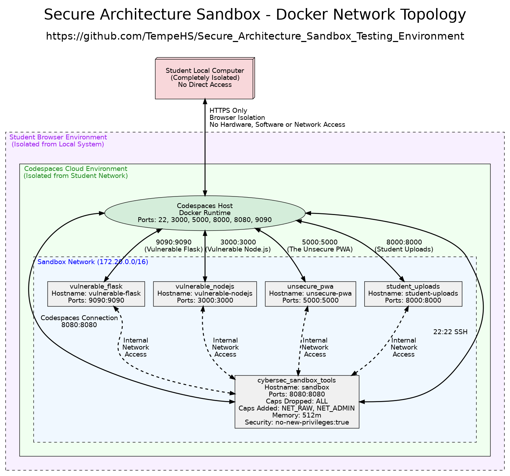

# Secure Architecture Sandbox Testing Environment - Student App Requirements

## 🎯 Overview

Quick reference for students creating **Flask or Django** applications for
cybersecurity testing. This guide demonstrates how **application isolation and
containment** principles support **safe execution environments for untrusted
code** - key concepts in cybersecurity architecture.

The sandbox automatically detects your application entry point file
(`app.py`, `main.py`, `run.py`, or `manage.py`) and launches it correctly.

## 🐳 Understanding Our Educational Architecture

### Why Two Containers? Professional Security Testing Design

This sandbox uses a **multi-layer isolation and containerized architecture** using Codespaces and Docker that mirrors real-world cybersecurity practices.


**Educational Benefits:**

- **Separation of Concerns**: Clear distinction between testing tools and
  targets
- **Professional Realism**: Mirrors penetration testing and incident response
  workflows
- **Safe Experimentation**: **Resource limitation and monitoring** prevents
  system damage
- **Security by Design**: Multiple isolation layers protect both containers and
  host

### Container Security Features

**Industry-Standard Isolation Techniques:**

- **Process Isolation**: Each container runs in its own process space
- **Network Segmentation**: Controlled communication between containers
- **File System Isolation**: Containers cannot access host or other container
  files
- **Resource Limits**: CPU and memory restrictions prevent resource abuse
- **Capability Restrictions**: Limited system permissions following least
  privilege principles

## 📝 Application Requirements

### Supported Entry Point Files

The container automatically detects your entry point in this priority order:

| Priority | File | Framework | Notes |
|----------|------|-----------|-------|
| 1 | `app.py` | Flask | Most common for Flask apps |
| 2 | `main.py` | Flask | Alternative Flask entry point |
| 3 | `run.py` | Flask | Alternative Flask entry point |
| 4 | `manage.py` | Django | See [Django Setup](#-django-application-setup) below |

> **Note:** Only place **one** entry point file in the `uploads/` folder. If
> multiple are present the highest priority file will be used.

### Required Files and Structure (Flask)

```
uploads/
├── app.py             # Entry point (or main.py / run.py)
├── requirements.txt   # Python dependencies
└── README.md         # Optional documentation
```

### Flask File Specifications

#### Entry Point (`app.py` / `main.py` / `run.py`)

Whichever filename you choose, the file must:

- Import Flask: `from flask import Flask`
- Create an app instance: `app = Flask(__name__)`
- Include at least one route: `@app.route("/")`
- Run on **port 8000**: `app.run(debug=True, host='0.0.0.0', port=8000)`

**Example `app.py`** (also valid as `main.py` or `run.py`):

```python
from flask import Flask

app = Flask(__name__)

@app.route("/")
def hello_world():
    return "<p>Hello from the Secure Architecture Testing Sandbox!</p>"

if __name__ == '__main__':
    app.run(debug=True, host='0.0.0.0', port=8000)
```

#### `requirements.txt` Requirements

- Must include: `Flask==2.3.3`
- Add other packages as needed with specific versions

### Port Assignment

- **Use port 8000** for your application (Flask or Django)
- **Do NOT use port 3000, 5000, 8080 or 9000** (reserved)

## 🔄 Docker Management

### Understanding Container Lifecycle for Security Testing

The container lifecycle demonstrates key **security testing and evaluation**
principles:

**1. Preparation Phase** (Container Creation)

- **Systematic vulnerability assessment** setup
- **Security configuration and controls** implementation
- **Safe execution environment** preparation

**2. Testing Phase** (Container Execution)

- **Behavioural analysis and threat detection** in isolation
- **Resource limitation and monitoring** during analysis
- **Controlled application testing** without host system risk

**3. Analysis Phase** (Data Collection)

- **Evidence collection** from isolated environment
- **Security findings documentation** with contained logs
- **Risk assessment** based on observed behaviours

**4. Cleanup Phase** (Container Disposal)

- **Secure evidence handling** and report generation
- **Environment reset** for next testing cycle
- **Incident response** preparation if threats detected

### Deploy Your App

```bash
# 1. Rebuild and restart the student-uploads container
docker-compose -f docker/docker-compose.yml up -d --build student-uploads

# 2. Start the Docker services (if not already running)
docker-compose -f docker/docker-compose.yml up -d

# 3. Check if your app is running
# https://your-codespace-name-8000.app.github.dev

```

### Refresh/Restart Commands

```bash
# Restart all Docker services (demonstrates container resilience)
docker-compose -f docker/docker-compose.yml restart

# Stop and restart fresh (clean slate for testing)
docker-compose -f docker/docker-compose.yml down
docker-compose -f docker/docker-compose.yml up -d

# Kill your app and restart (incident response simulation)
docker-compose -f docker/docker-compose.yml restart student-uploads
```

## 🌐 Access Your Application

### URLs

- **Codespaces**: `https://your-codespace-name-8000.app.github.dev`
- **Local test**: `curl http://localhost:8000`
- **Web file browser**: `http://localhost:8080/uploads/` (nginx serves uploads
  folder)

## 🔒 Security Testing Commands

These commands demonstrate **systematic vulnerability assessment** and **security management strategies** in containerised environments:

### Static Analysis (SAST) - **Source Code Analysis**

```bash
python src/analyser/analyse_cli.py samples/unsecure-pwa --tools all --educational --output detailed_sast_unsecure_pwa.pdf --format pdf --verbose
```

### Dynamic Analysis (DAST) - **Runtime Testing**

```bash
python src/analyser/dast_cli.py http://localhost:8000 --deep-scan --educational --output detailed_dast_unsecure_pwa.pdf --format pdf --verbose
```

### Network Analysis - **Systematic Security Evaluation**

```bash
python src/analyser/network_cli.py --monitor-connections --educational --duration 300 --output detailed_network_unsecure_pwa.pdf --format pdf --verbose
```

### Penetration Testing - **Ethical Hacking and Exploitation Testing**

```bash
python src/analyser/penetration_analyser.py http://localhost:8000 --deep --output detailed_pentest_unsecure_pwa.pdf
```

## 🐍 Django Application Setup

### Why Django Needs Extra Configuration

Django applications use `manage.py runserver` instead of running a file
directly. The sandbox entrypoint script detects `manage.py` and automatically
runs `python manage.py runserver 0.0.0.0:8000`.

However, Django requires additional configuration to work correctly in the
container:

### Step 1: Create Your Django Project Structure

Place the following files in the `uploads/` folder:

```
uploads/
├── manage.py
├── requirements.txt
├── config/
│   ├── __init__.py
│   ├── settings.py
│   ├── urls.py
│   └── wsgi.py
└── myapp/
    ├── __init__.py
    ├── views.py
    ├── urls.py
    └── models.py
```

### Step 2: Configure `settings.py`

Your `config/settings.py` must include these settings for the container:

```python
import os

# SECURITY WARNING: In production, restrict this to your domain
ALLOWED_HOSTS = ['*']

# Use SQLite for simplicity in the sandbox
DATABASES = {
    'default': {
        'ENGINE': 'django.db.backends.sqlite3',
        'NAME': os.path.join(BASE_DIR, 'db.sqlite3'),
    }
}

# Static files
STATIC_URL = '/static/'
```

> **Important**: `ALLOWED_HOSTS = ['*']` is required for the container
> networking to work. This is intentionally insecure for educational purposes.

### Step 3: Configure `manage.py`

Your `manage.py` should point to your settings module:

```python
#!/usr/bin/env python
import os
import sys

def main():
    os.environ.setdefault('DJANGO_SETTINGS_MODULE', 'config.settings')
    from django.core.management import execute_from_command_line
    execute_from_command_line(sys.argv)

if __name__ == '__main__':
    main()
```

### Step 4: Configure `requirements.txt`

```
Django>=4.2,<5.0
```

### Step 5: Deploy and Migrate

```bash
# Build and start the container
docker-compose -f docker/docker-compose.yml up -d --build student-uploads

# Run Django migrations inside the container
docker exec student_uploads python manage.py migrate

# (Optional) Create a Django superuser
docker exec -it student_uploads python manage.py createsuperuser
```

### Django Troubleshooting

```bash
# Check container logs for Django errors
docker logs student_uploads

# Verify Django settings are loaded
docker exec student_uploads python manage.py check

# Run migrations if you see database errors
docker exec student_uploads python manage.py migrate
```
## 🐛 Quick Troubleshooting

```bash
# Check if app is running
curl http://localhost:8000

# View container logs to see which entry point was detected
docker logs student_uploads

# Restart the student app container
docker-compose -f docker/docker-compose.yml restart student-uploads

# Full rebuild after changing files
docker-compose -f docker/docker-compose.yml up -d --build student-uploads

# Check port usage
docker exec student_uploads netstat -tulpn | grep :8000
```
