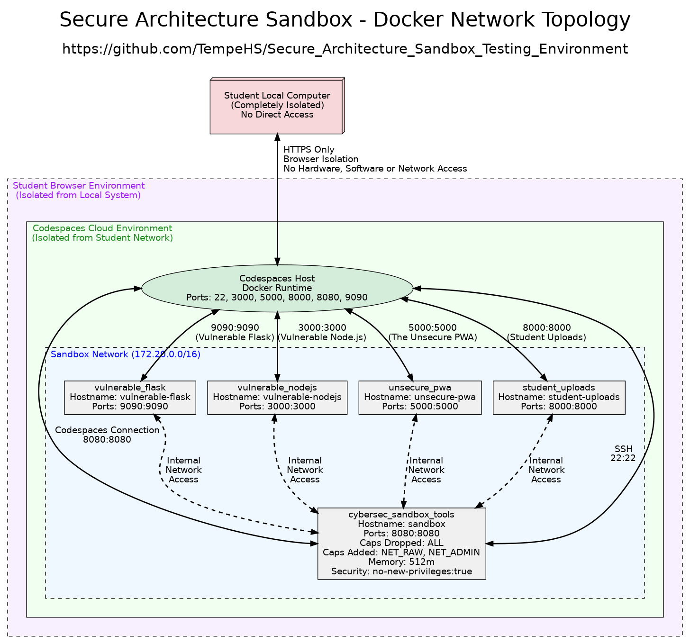

# Secure Architecture Sandbox Testing Environment - Student Flask App Requirements

## 🎯 Overview

Quick reference for students creating Flask applications for cybersecurity
testing. This guide demonstrates how **application isolation and containment**
principles support **safe execution environments for untrusted code** - key
concepts in cybersecurity architecture.

## 🐳 Understanding Our Educational Architecture

### Why Two Containers? Professional Security Testing Design

This sandbox uses a **multi-layer isolation and containerized architecture** using Codespaces and Docker that mirrors real-world cybersecurity practices.


**Educational Benefits:**

- **Separation of Concerns**: Clear distinction between testing tools and
  targets
- **Professional Realism**: Mirrors penetration testing and incident response
  workflows
- **Safe Experimentation**: **Resource limitation and monitoring** prevents
  system damage
- **Security by Design**: Multiple isolation layers protect both containers and
  host

### Container Security Features

**Industry-Standard Isolation Techniques:**

- **Process Isolation**: Each container runs in its own process space
- **Network Segmentation**: Controlled communication between containers
- **File System Isolation**: Containers cannot access host or other container
  files
- **Resource Limits**: CPU and memory restrictions prevent resource abuse
- **Capability Restrictions**: Limited system permissions following least
  privilege principles

## � Application Requirements

### Required Files and Structure

```
uploads/
├── app.py             # Main Flask application
├── requirements.txt   # Python dependencies
└── README.md         # Optional documentation
```

### File Specifications

#### `app.py` Requirements

- Must import Flask: `from flask import Flask`
- Must create app instance: `app = Flask(__name__)`
- Must include at least one route: `@app.route("/")`
- Must run on port 8000: `app.run(debug=True, host='0.0.0.0', port=8000)`

#### `requirements.txt` Requirements

- Must include: `Flask==2.3.3`
- Add other packages as needed with specific versions

### Port Assignment

- **Use port 8000** for your Flask application
- **Do NOT use port 3000, 5000, 8080 or 9000** (reserved)

## 🔄 Docker Management

### Understanding Container Lifecycle for Security Testing

The container lifecycle demonstrates key **security testing and evaluation**
principles:

**1. Preparation Phase** (Container Creation)

- **Systematic vulnerability assessment** setup
- **Security configuration and controls** implementation
- **Safe execution environment** preparation

**2. Testing Phase** (Container Execution)

- **Behavioural analysis and threat detection** in isolation
- **Resource limitation and monitoring** during analysis
- **Controlled application testing** without host system risk

**3. Analysis Phase** (Data Collection)

- **Evidence collection** from isolated environment
- **Security findings documentation** with contained logs
- **Risk assessment** based on observed behaviours

**4. Cleanup Phase** (Container Disposal)

- **Secure evidence handling** and report generation
- **Environment reset** for next testing cycle
- **Incident response** preparation if threats detected

### Deploy Your App

```bash
# 1. Rebuild and restart the student-uploads container
docker-compose -f docker/docker-compose.yml up -d --build student-uploads

# 2. Start the Docker services (if not already running)
docker-compose -f docker/docker-compose.yml up -d

# 3. Check if your app is running
# https://your-codespace-name-8000.app.github.dev

```

### Refresh/Restart Commands

```bash
# Restart all Docker services (demonstrates container resilience)
docker-compose -f docker/docker-compose.yml restart

# Stop and restart fresh (clean slate for testing)
docker-compose -f docker/docker-compose.yml down
docker-compose -f docker/docker-compose.yml up -d

# Kill your app and restart (incident response simulation)
docker exec cybersec_sandbox pkill -f "python.*app.py"
docker exec -d cybersec_sandbox bash -c "cd /workspace/uploads && python3 app.py"
```

## 🌐 Access Your Application

### URLs

- **Codespaces**: `https://your-codespace-name-8000.app.github.dev`
- **Local test**: `curl http://localhost:8000`
- **Web file browser**: `http://localhost:8080/uploads/` (nginx serves uploads
  folder)

## 🔒 Security Testing Commands

These commands demonstrate **systematic vulnerability assessment** and **security management strategies** in containerised environments:

### Static Analysis (SAST) - **Source Code Analysis**

```bash
python src/analyser/analyse_cli.py samples/unsecure-pwa --tools all --educational --output detailed_sast_unsecure_pwa.pdf --format pdf --verbose
```

### Dynamic Analysis (DAST) - **Runtime Testing**

```bash
python src/analyser/dast_cli.py http://localhost:8000 --deep-scan --educational --output detailed_dast_unsecure_pwa.pdf --format pdf --verbose
```

### Network Analysis - **Systematic Security Evaluation**

```bash
python src/analyser/network_cli.py --monitor-connections --educational --duration 300 --output detailed_network_unsecure_pwa.pdf --format pdf --verbose
```

### Penetration Testing - **Ethical Hacking and Exploitation Testing**

```bash
python src/analyser/penetration_analyser.py http://localhost:8000 --deep --output detailed_pentest_unsecure_pwa.pdf
```

## 🐛 Quick Troubleshooting

```bash
# Check if app is running
curl http://localhost:8000

# Kill and restart your app
docker exec cybersec_sandbox pkill -f "python.*app.py"
docker exec -d cybersec_sandbox bash -c "cd /workspace/uploads && python3 app.py"

# Check port usage
docker exec cybersec_sandbox netstat -tulpn | grep :8000
```
